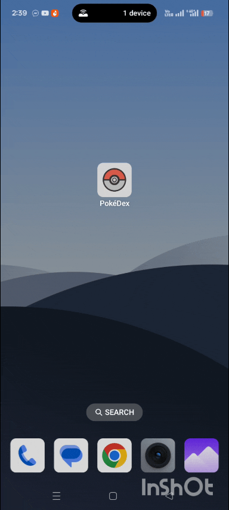
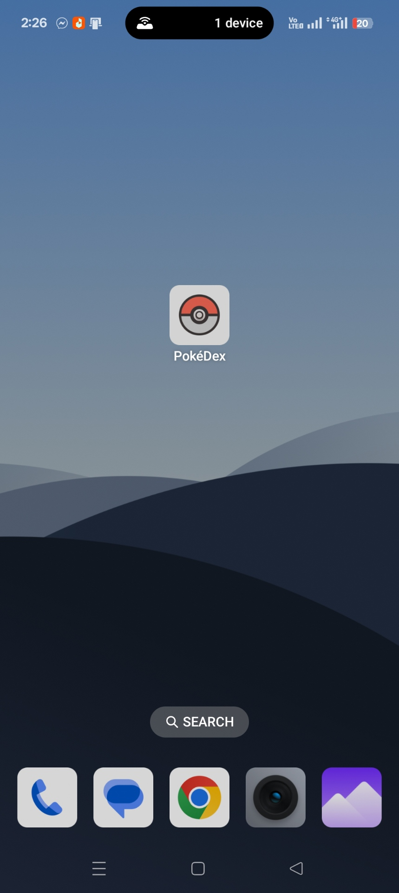
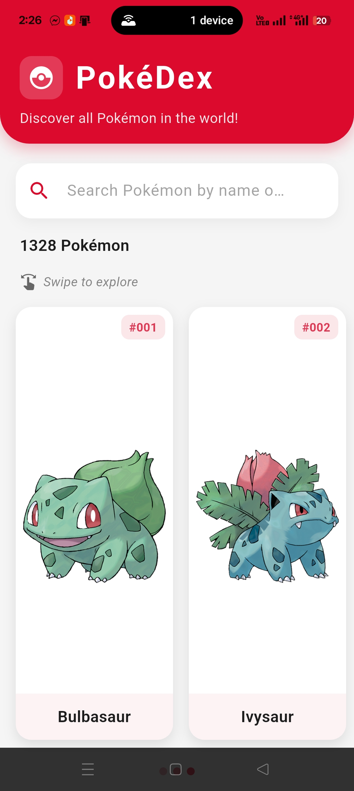
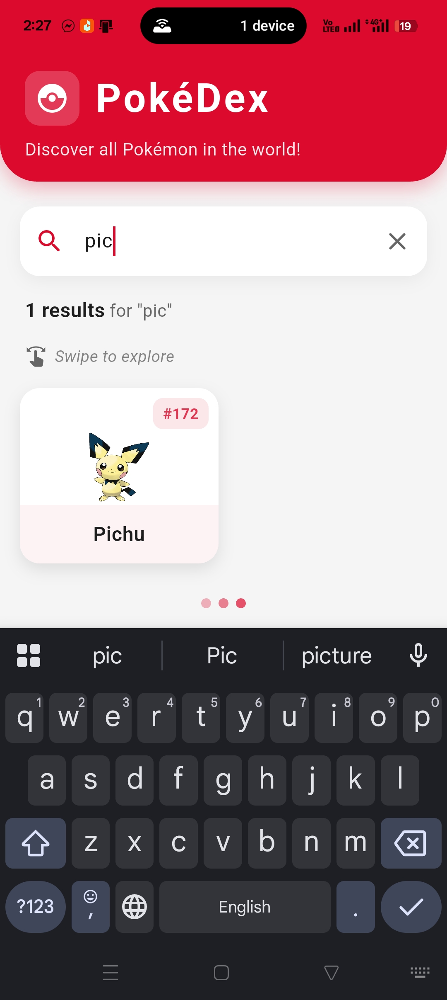
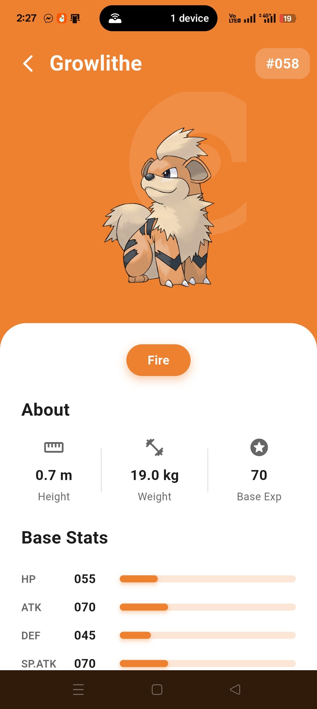
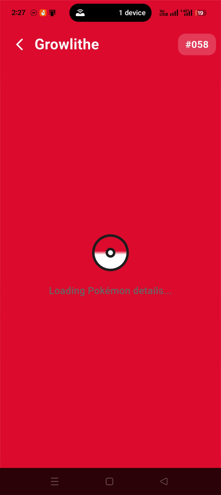

# PokéDex

PokéDex is a Flutter application that displays comprehensive Pokémon information using the official [PokéAPI](https://pokeapi.co/). Built with clean architecture principles and BLoC pattern for state management, this app demonstrates professional Flutter development practices including proper error handling, loading states, and responsive UI design.

## Table of Contents
- [GIFs](#gifs)
- [Screenshots](#screenshots)
- [Features](#features)
- [Technical Stack](#technical-stack)
- [Project Structure / Architecture](#project-structure--architecture)
- [Generative AI Usage](#generative-ai-usage)
- [Download APK](#download-apk)
- [How to Run](#how-to-run)
- [Best Practices](#best-practices)
- [Contact](#contact)

## GIFs

Check out this GIF showcasing the app in action:

### App Demo
<p align="center">
  
</p>

## Screenshots

Here are screenshots from the app, organized by feature:

### App Icon
<p align="center">
  
</p>

### Home Screen
<p align="center">
  
</p>

### Search Functionality
<p align="center">
  
</p>

### Detail Screen
<p align="center">
  
</p>

### Loading States
| List Loading | Detail Loading |
|--------------|----------------|
|  |  |

## Features

- **Horizontal Scrolling List** - Elegant card-based UI for browsing through all 1,300+ Pokémon with smooth horizontal scrolling
- **Real-time Search** - Search Pokémon by name or ID with instant filtering
- **Comprehensive Details** - View detailed information including:
  - Height and weight metrics
  - Base stats (HP, Attack, Defense, Speed, etc.)
  - Pokémon types with dynamic color theming
  - Abilities (including hidden abilities)
  - Official artwork images
- **Type-Based Theming** - Dynamic background colors based on Pokémon type (Fire = Orange, Water = Blue, etc.)
- **Robust Error Handling** - Custom exception handling with user-friendly error messages and retry functionality
- **Loading States** - Custom Pokéball-themed loading indicators for better user experience
- **Pull-to-Refresh** - Refresh the Pokémon list with pull-down gesture
- **Hero Animations** - Smooth transitions when navigating between screens

## Technical Stack

| Technology | Purpose | Version |
|-----------|---------|---------|
| **Flutter** | Cross-platform UI framework | Latest Stable |
| **flutter_bloc** | State management using BLoC pattern | ^9.1.0 |
| **equatable** | Value equality for BLoC states and events | ^2.0.7 |
| **http** | HTTP client for API requests | ^1.4.0 |
| **cached_network_image** | Efficient image loading and caching | ^3.4.1 |

### Additional Technologies
- **Dart SDK** - Programming language (^3.9.0)
- **PokéAPI** - RESTful API for Pokémon data
- **Material Design 3** - Modern UI design system

## Project Structure / Architecture

This project follows **Clean Architecture** principles with a clear separation of concerns across three main layers:

### Layered Architecture

```
lib/
├── core/                          # Core utilities and shared code
│   ├── constants/
│   │   └── app_constants.dart     # App-wide constants (API URLs, UI constants)
│   ├── errors/
│   │   └── exceptions.dart        # Custom exception classes (Network, Server, Parsing)
│   └── theme/
│       └── app_theme.dart         # App theming, colors, and type-based colors
│
├── data/                          # Data layer (Repository Pattern)
│   ├── datasources/
│   │   └── pokemon_remote_datasource.dart  # HTTP API calls to PokéAPI
│   ├── models/
│   │   ├── pokemon_model.dart              # Pokémon list model
│   │   └── pokemon_detail_model.dart       # Detailed Pokémon information model
│   └── repositories/
│       └── pokemon_repository.dart         # Repository implementation (abstraction layer)
│
├── presentation/                  # Presentation layer (BLoC Pattern)
│   ├── blocs/
│   │   ├── pokemon_list/
│   │   │   ├── pokemon_list_bloc.dart      # Business logic for list screen
│   │   │   ├── pokemon_list_event.dart     # User actions (Fetch, Search, Refresh)
│   │   │   └── pokemon_list_state.dart     # UI states (Loading, Loaded, Error)
│   │   └── pokemon_detail/
│   │       ├── pokemon_detail_bloc.dart    # Business logic for detail screen
│   │       ├── pokemon_detail_event.dart   # User actions (Fetch, Reset)
│   │       └── pokemon_detail_state.dart   # UI states (Loading, Loaded, Error)
│   ├── screens/
│   │   ├── pokemon_list_screen.dart        # Home screen with horizontal list
│   │   └── pokemon_detail_screen.dart      # Detail screen with stats and abilities
│   └── widgets/
│       ├── pokemon_card.dart               # Reusable Pokémon card widget
│       ├── loading_widget.dart             # Custom loading indicator
│       └── error_widget.dart               # Error display with retry button
│
└── main.dart                      # App entry point and BLoC providers setup
```

### BLoC Pattern Implementation

The app uses **BLoC (Business Logic Component)** pattern for state management, ensuring unidirectional data flow:

#### Pokémon List BLoC
- **Events**: 
  - `FetchPokemonList` - Initial data fetch
  - `RefreshPokemonList` - Pull-to-refresh action
  - `SearchPokemon(String query)` - Real-time search filtering
  - `ClearSearch` - Reset search filter
  
- **States**: 
  - `PokemonListInitial` - Initial state before any data load
  - `PokemonListLoading` - Loading indicator shown
  - `PokemonListLoaded` - Success state with Pokémon list data
  - `PokemonListError` - Error state with error message

#### Pokémon Detail BLoC
- **Events**: 
  - `FetchPokemonDetail(String url, String pokemonName)` - Fetch detailed information
  - `ResetPokemonDetail` - Reset state when leaving screen
  
- **States**: 
  - `PokemonDetailInitial` - Initial state
  - `PokemonDetailLoading` - Loading with Pokémon name displayed
  - `PokemonDetailLoaded` - Success with complete Pokémon details
  - `PokemonDetailError` - Error state with retry option

### Data Flow Architecture

```
┌─────────────────────────────────────────────────────────────┐
│                    UNIDIRECTIONAL DATA FLOW                  │
└─────────────────────────────────────────────────────────────┘

UI Widgets (Screens/Widgets)
        │
        │ dispatches Events
        ▼
   BLoC Layer
   (Business Logic)
        │
        │ calls methods
        ▼
  Repository Layer
  (Data Abstraction)
        │
        │ calls methods
        ▼
  DataSource Layer
  (API Calls)
        │
        │ HTTP requests
        ▼
     PokéAPI
        │
        │ JSON responses
        ▼
   Models (Parsing)
        │
        │ emits States
        ▼
   BLoC Layer
        │
        │ state changes
        ▼
   UI Widgets
   (Rebuilds)
```

### Key Architectural Decisions

1. **Repository Pattern**: Abstracts data sources, making it easy to switch between APIs or add local caching
2. **BLoC Pattern**: Separates business logic from UI, making code testable and maintainable
3. **Custom Exceptions**: Type-specific error handling (NetworkException, ServerException, etc.)
4. **Immutable States**: Using Equatable ensures proper state comparison and prevents unnecessary rebuilds
5. **Widget Composition**: Reusable widgets (PokemonCard, LoadingWidget, ErrorWidget) for code reusability

## Generative AI Usage

This project was developed with assistance from AI coding tools. Here's an honest explanation of how AI was utilized:

### Tools Used
- **Claude AI (Cursor IDE)** - Primary AI assistant for code generation and architecture guidance

### How AI Was Used

AI was used as a **development accelerator** and **learning tool**, not as a replacement for understanding. The key approach was:

1. **Learning New Patterns**: As someone with GetX experience but new to BLoC, AI helped understand the BLoC pattern through guided examples
2. **Architecture Design**: Used AI to design the clean architecture structure, then manually reviewed and understood each layer
3. **Code Generation**: Generated boilerplate code (models, BLoCs, widgets) which was then customized and optimized
4. **Error Debugging**: Used AI to understand and fix errors during development
5. **Best Practices**: Consulted AI for Flutter and BLoC best practices

### Essential Prompts Used

1. **Initial Project Setup**:
   ```
   "Create a Flutter PokéDex application following clean architecture principles 
   with BLoC state management. The app should have three layers: data, domain, 
   and presentation. Use the PokéAPI to fetch Pokémon data."
   ```

2. **BLoC Implementation**:
   ```
   "Help me implement BLoC pattern for the Pokémon list screen. I need to handle:
   - Fetching list of Pokémon from API
   - Loading states
   - Error handling with retry functionality
   - Search/filter functionality
   - Pull-to-refresh
   
   Show me the event, state, and bloc files with proper error handling."
   ```

3. **State Management**:
   ```
   "I'm coming from GetX background. Explain how BLoC pattern differs from GetX 
   controllers. Show me how to dispatch events and listen to state changes in UI."
   ```

4. **Error Handling**:
   ```
   "Implement robust error handling for network failures. Create custom exception 
   classes for different error types (network, server, parsing) and show user-friendly 
   error messages with retry options."
   ```

5. **UI Design**:
   ```
   "Create a beautiful horizontal scrolling list for Pokémon cards. Each card should 
   show the Pokémon image, name, and ID. Add a search bar at the top and implement 
   type-based color theming for the detail screen background."
   ```

6. **Code Review**:
   ```
   "Review this BLoC implementation and suggest improvements for:
   - Performance optimization
   - Code reusability
   - Best practices
   - Error handling edge cases"
   ```

### AI Contribution vs Manual Work

**AI Assisted:**
- Initial project structure and architecture setup
- BLoC boilerplate code generation
- Model classes from API responses
- Error handling structure
- UI widget templates

**Manually Implemented:**
- Business logic refinement and optimization
- Custom error messages and user experience
- UI/UX design decisions
- Performance optimizations (caching, state management)
- Code review and refactoring
- Testing and debugging

### Learning Outcomes

Using AI in this project helped me:
- **Understand BLoC Pattern**: Learned the unidirectional data flow, events, and states
- **Apply Clean Architecture**: Understood layer separation and dependency injection
- **Write Better Code**: Learned Flutter best practices (immutability, const constructors, widget composition)
- **Debug Effectively**: Improved error handling and debugging skills

This project demonstrates that AI is a powerful tool for learning and productivity, but understanding the code and making architectural decisions is crucial for becoming a better developer.

## Download APK

Ready-to-install APK files are available for download. Choose the appropriate version based on your device architecture:

### 📱 Recommended: Universal APK
**[PokeDex.apk](apks/PokeDex.apk)** - Universal APK compatible with most Android devices (Recommended for most users)

### 📦 Architecture-Specific APKs

If the universal APK doesn't work on your device, try these architecture-specific builds:

| APK File | Architecture | Best For |
|----------|--------------|----------|
| [PokeDex.apk](apks/PokeDex.apk) | Universal | Most Android devices (Recommended) |
| [app-armeabi-v7a-release.apk](apks/app-armeabi-v7a-release.apk) | ARM 32-bit | Older Android devices with 32-bit processors |
| [app-x86_64-release.apk](apks/app-x86_64-release.apk) | x86 64-bit | Android emulators and x86-based devices |

### 🌐 Google Drive Download

All APK files are also available on Google Drive for easy download:

**[📥 Download from Google Drive](https://drive.google.com/drive/folders/1xmHE8VpGnSHUXpO_iEroYkWf9Z7gkA73?usp=sharing)**

### Installation Instructions

1. **Download** the APK file to your Android device
2. **Enable** "Install from Unknown Sources" in your device settings
3. **Open** the downloaded APK file
4. **Tap** "Install" and wait for the installation to complete
5. **Launch** the PokéDex app from your app drawer

## How to Run

### Prerequisites
- Flutter SDK (latest stable version) - [Install Flutter](https://flutter.dev/docs/get-started/install)
- Dart SDK (included with Flutter)
- Android Studio / VS Code with Flutter extensions
- An Android/iOS device or emulator

### Installation Steps

1. **Clone the repository**
   ```bash
   git clone https://github.com/yourusername/pokedex.git
   cd pokedex
   ```

2. **Install dependencies**
   ```bash
   flutter pub get
   ```

3. **Run the app**
   ```bash
   flutter run
   ```

### Build Release APK

To build a release APK for Android:

```bash
flutter build apk --release
```

The APK will be generated at: `build/app/outputs/flutter-apk/app-release.apk`

To build architecture-specific APKs:

```bash
# Build for all architectures
flutter build apk --split-per-abi

# Build for specific architecture
flutter build apk --target-platform android-arm64  # 64-bit ARM
flutter build apk --target-platform android-arm   # 32-bit ARM
flutter build apk --target-platform android-x64   # 64-bit x86
```

### Build for iOS

To build for iOS:

```bash
flutter build ios --release
```

### Run Tests

```bash
flutter test
```

## Best Practices

This project implements industry-standard best practices:

### Code Quality
- ✅ **Separation of Concerns** - Clean layered architecture (Data, Repository, Presentation)
- ✅ **Immutable State** - Using Equatable for proper state comparison
- ✅ **const Constructors** - Optimized widget rebuilds
- ✅ **final Variables** - Immutable data structures where applicable
- ✅ **Type Safety** - Proper type annotations throughout

### Error Handling
- ✅ **Custom Exceptions** - Type-specific error classes (NetworkException, ServerException, ParsingException)
- ✅ **User-Friendly Messages** - Clear error messages displayed to users
- ✅ **Retry Functionality** - Users can retry failed operations
- ✅ **Graceful Degradation** - App handles edge cases gracefully

### UI/UX
- ✅ **Loading Indicators** - Custom Pokéball-themed loading widgets
- ✅ **Error Widgets** - Reusable error display components
- ✅ **Responsive Design** - Adapts to different screen sizes
- ✅ **Smooth Animations** - Hero animations and transitions
- ✅ **Pull-to-Refresh** - Standard mobile UX pattern

### Architecture
- ✅ **Repository Pattern** - Abstraction layer for data sources
- ✅ **BLoC Pattern** - Unidirectional data flow
- ✅ **Dependency Injection** - Clean dependency management
- ✅ **Widget Composition** - Reusable, composable widgets

### Documentation
- ✅ **Code Comments** - Dartdoc comments for all public APIs
- ✅ **README Documentation** - Comprehensive project documentation
- ✅ **Meaningful Names** - Self-documenting code with clear naming conventions

## Contact

For any questions, feedback, or collaboration opportunities, please reach out:

- **Email**: [sakibahmed21@iut-dhaka.edu](mailto:sakibahmed21@iut-dhaka.edu)

---

**Note**: This project was developed as part of a Flutter internship assessment, demonstrating proficiency in Flutter development, BLoC state management, clean architecture, and REST API integration.

## Acknowledgments

- [PokéAPI](https://pokeapi.co/) - For providing comprehensive Pokémon data via REST API
- [Flutter Team](https://flutter.dev/) - For the amazing cross-platform framework
- [BLoC Library](https://bloclibrary.dev/) - For the powerful state management solution
